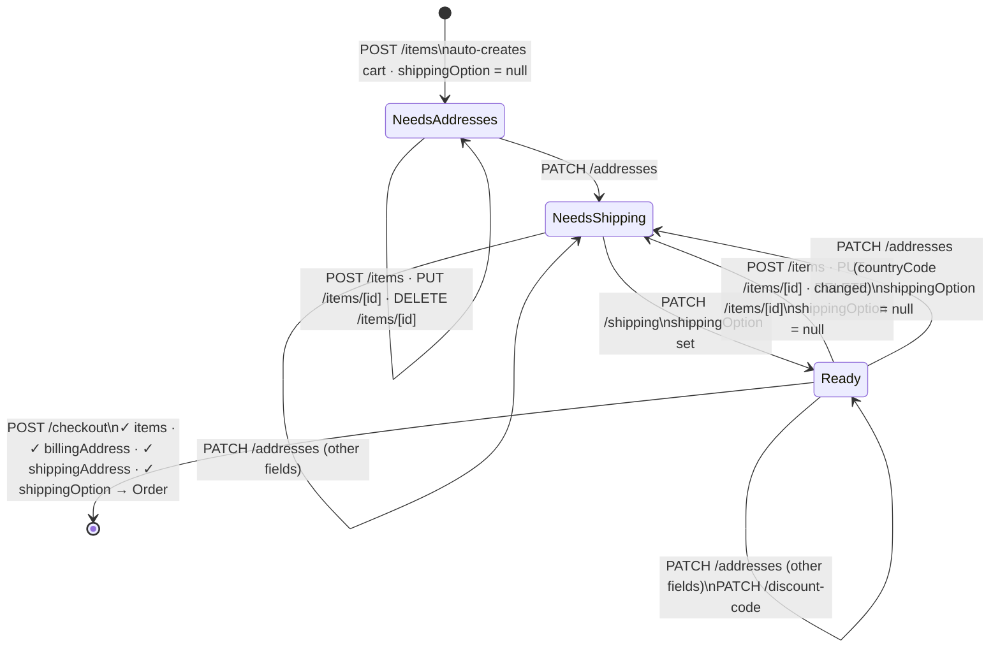

# Cart API (v2)

The cart is the checkout session. It accumulates all data needed to place an order: line items, addresses, shipping option, and discount code. `POST /order` only requires a `cartId`.

A cart is created automatically when the first line item is added via `POST /cart/line-item` — there is no separate cart creation step.

See [_types.md](./_types.md) for `Cart`, `CartLineItem`.

---

## Checkout Flow

The cart progresses through three states before an order can be created. Line item changes invalidate the shipping option but never the addresses.

**Shipping option invalidation rules:**
- Adding, updating, or removing a line item sets `shippingOption = null`
- Changing `shippingAddress.countryCode` sets `shippingOption = null`
- All other address field changes and discount code changes have no effect on `shippingOption`

**Checkout gates** — `POST /checkout` returns `400` if any of these are missing:
- At least one line item
- `billingAddress`
- `shippingAddress`
- `shippingOption`

---

## Get Cart

### `GET /cart/[cartId]`

Returns a cart by ID.

**Path params:**
| Param | Type |
|-------|------|
| `cartId` | `string` |

**Response:** `Cart`

> Returns 404 if cart is not found or ID is invalid.

---

## Migration Notes

| v1 | v2 | Notes |
|----|-----|-------|
| Cart as item list | Cart as checkout session | Cart now accumulates addresses, shipping option, and discount code before order creation |
| `POST /cart/[id]/order-merge` | removed | Out of scope |
