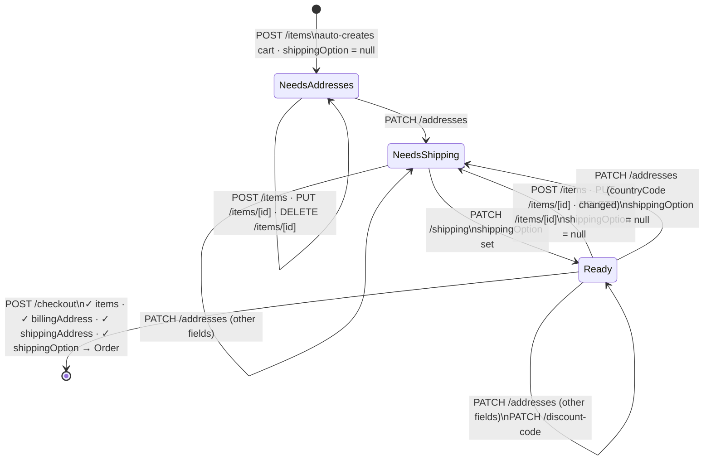

# Cart Checkout API (v2)

Endpoints for the checkout progression: addresses, shipping, discount, and order creation.

See [_types.md](./_types.md) for `Cart`.
See [../_shared-types.md](../_shared-types.md) for `Address`.

---

## Checkout Flow

The cart progresses through three states before an order can be created. Line item changes invalidate the shipping option but never the addresses.



**Shipping option invalidation rules:**
- Adding, updating, or removing a line item sets `shippingOption = null`
- Changing `shippingAddress.countryCode` sets `shippingOption = null`
- All other address field changes and discount code changes have no effect on `shippingOption`

**Checkout gates** — `POST /checkout` returns `400` if any of these are missing:
- At least one line item
- `billingAddress`
- `shippingAddress`
- `shippingOption`

---

## Set Addresses

### `PATCH /cart/[cartId]/addresses`

Sets or partially updates the billing address, shipping address, and customer contact details. Supports progressive saves — call as the user fills in the form so data is not lost on page refresh. Validation of required fields only happens at `POST /cart/[cartId]/checkout` time.

**Path params:**
| Param | Type |
|-------|------|
| `cartId` | `string` |

**Request body:** All fields optional — only send what changed.

```ts
{
  billingAddress?: {
    firstName?: string
    lastName?: string
    email?: string
    company?: string | null
    vatNumber?: string | null
    addressLine1?: string
    addressLine2?: string | null
    zip?: string
    city?: string
    state?: string | null
    country?: string
    countryCode?: string
    phone?: string
  }
  shippingAddress?: {
    firstName?: string
    lastName?: string
    email?: string
    company?: string | null
    // vatNumber not applicable for shipping address
    addressLine1?: string
    addressLine2?: string | null
    zip?: string
    city?: string
    state?: string | null
    country?: string
    countryCode?: string
    phone?: string
  }
}
```

**Response:** Updated `Cart`

---

## Get Shipping Options

### `GET /cart/[cartId]/shipping-options`

Returns available shipping options with costs and estimated delivery dates for a cart and destination country.

**Path params:**
| Param | Type |
|-------|------|
| `cartId` | `string` |

**Query params:**

```ts
{
  countryCode: string // ISO 3166-1 alpha-2 destination country code
}
```

**Response:**

```ts
{
  dates: Array<{
    deliveryDate: string    // ISO date string — estimated delivery date
    shippingCost: number    // EUR
    service: {
      type: 'standard' | 'express'
      name: string
      carrier: 'ups' | 'fedex'
      transitTime: { days: number; bufferDays?: number }
    }
    category: 'fast' | 'standard' | 'long-term'
  }>
  manualQuoteRequired: boolean  // true when automated pricing is unavailable
  error?: string
}
```

> Returns 404 if cart is not found. No cache.

### Notes

`predefinedDeliveryDate` is the first `standard`-category option's `deliveryDate`. It is stored server-side when the shipping option is saved and is not sent by the client.

---

## Set Shipping Option

### `PATCH /cart/[cartId]/shipping`

Sets the selected shipping option. Shipping options are fetched from `GET /cart/[cartId]/shipping-options` — the frontend selects one and calls this endpoint to persist the choice.

**Path params:**
| Param | Type |
|-------|------|
| `cartId` | `string` |

**Request body:**

```ts
{
  deliveryDate: string // customer-chosen date (ISO date string)
}
```

> **Design note:** Only `deliveryDate` is sent. For a given destination and cart, each date maps to exactly one shipping option (method, carrier, cost), so `deliveryDate` alone is sufficient to identify the selection. `cost`, `method`, and `predefinedDeliveryDate` are all server-resolved and never trusted from the client. An earlier team discussion considered echoing `cost` back for stale-price detection — ruled out because shipping option invalidation on cart changes (see state machine above) already handles that, and a client-supplied price adds attack surface without benefit.

**Response:** Updated `Cart`

---

## Apply Discount Code

### `PATCH /cart/[cartId]/discount-code`

Applies or removes a discount code from the cart. The backend validates the code and returns the updated cart with pricing recalculated. To remove an existing discount, send `code: null`.

**Path params:**
| Param | Type |
|-------|------|
| `cartId` | `string` |

**Request body:**

```ts
{
  code: string | null // null to remove the current discount code
}
```

**Response:** Updated `Cart`

> Returns `400` if the code is invalid, expired, or does not meet minimum order conditions.

---

## Create Order

### `POST /cart/[cartId]/checkout`

Creates a new order from the cart. The cart must have billing/shipping addresses and a shipping option set before calling this endpoint. The backend validates the cart state, checks product availability, decrements stock if applicable, and locks in all pricing.

The following are resolved server-side and must NOT be sent by the client:
- VAT rate (derived from shipping address country)
- Shipping cost (already on the cart from `PATCH /cart/[cartId]/shipping`)
- Product availability flag
- Discount code usage (decremented internally)

**Path params:**
| Param | Type |
|-------|------|
| `cartId` | `string` |

**Request body:**
```ts
{
  poNumber?: string                           // customer purchase order number
  orderNotes?: string
  paymentMethod: 'bank' | 'card' | 'klarna'
}
```

**Response:**
```ts
{
  id: string
  orderNumber: string
  fulfillmentStatus: 'PENDING'
  paymentMethod: 'bank' | 'card' | 'klarna'
  createdAt: string  // ISO date string
}
```

> Returns `400` if the cart is missing required data (addresses, shipping option).
> Returns `409` if a product in the cart is no longer available in the requested quantities.

---

## Migration Notes

| v1 | v2 | Notes |
|----|-----|-------|
| `GET /discount-codes/[id]` | removed | Discount applied via `PATCH /cart/[cartId]/discount-code` |
| `PUT /discount-codes/[id]` | removed | Internal — decremented automatically during order creation |
| `GET /shipping/info` | removed | Backend only |
